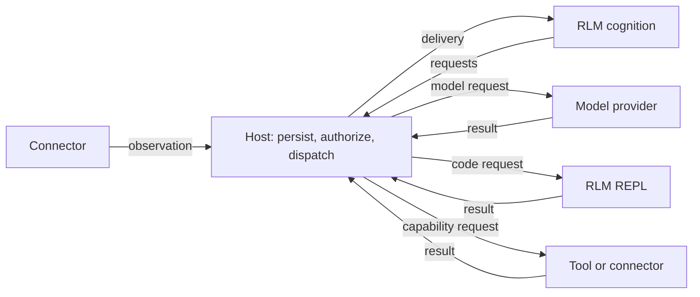

# Architecture

Pluribus assembles an agent from plugin packages. The native host owns durable
storage, authorization, dispatch, and Wasm execution. Plugins own interactions
with external systems and reasoning policy.

“Host” means the native application across [several crates](../crates/README.md).
[`pluribus-core`](../crates/pluribus-core/README.md) defines shared contracts;
it is not the whole host. [`pluribus-cognition`](../crates/pluribus-cognition/README.md)
routes and gates events. [RLM](../plugins/rlm/README.md) owns reasoning.

## One request

1. A connector admits input and emits `observation.received`.
2. The host commits it and delivers authorized events to cognition.
3. Cognition decides whether to act, builds context, and emits requests.
4. The host admits requests under their authority, revision, and resource limits.
5. Providers perform work and record correlated results. Cognition receives them.
6. A reply is a capability request to the originating connector. Completing
   reasoning does not establish that a message was delivered.

Delivery does not imply a model call. Cognition may update state, wait for input,
or ignore irrelevant events. See the [RLM trace](../plugins/rlm/event-flow.md)
for concrete event names and transitions.

## Ownership

| Owner | Responsibility |
| --- | --- |
| CLI | Assemble configuration, packages, storage, transports, and runtime |
| Host router | Admission, grants, request/result routing, attempts, cancellation |
| Wasm runtime | Component isolation, host imports, lifecycle, atomic delivery commits |
| Connector plugins | Sender admission, inbound observations, outbound delivery |
| RLM cognition | Jobs, observation association, prompts, context, reasoning decisions |
| Model plugins | Translate canonical requests and call model services |
| RLM REPL | Execute JavaScript cells and retain session state |
| Capability plugins | Execute operations such as shell commands and memory retrieval |

The agent configuration selects the model and provider. Cognition constructs
requests using that binding. Capability schemas come from installed manifests;
a schema describes an operation but grants no permission to execute it.

## Packages and components

A **package** contains a manifest, schemas, and one or more Wasm **components**.
An **instance** configures a package for an agent. Named components use IDs such
as `telegram/receive` and `rlm/repl`.

Each component has separate memory, state, delivery progress, and host grants.
Telegram separates receiving from sending; RLM separates cognition from its JS
interpreter. Native helpers, such as the shell executor, communicate over granted
endpoints. Their OS accounts determine the effects they can perform.

See [instances](plugin-instances.md) for configuration and
[plugins](../plugins/README.md) for package composition.

## Authority and durability

External text cannot grant authority. The host derives capability access from
recognized origins and configured grants, then checks the selected provider and
arguments before execution. Host transport and credential grants separately
restrict each component's imports. See [events and authority](events-and-authority.md)
and [plugin security](plugins/security.md).

SQLite stores events, state, credentials, and delivery progress. Filesystem storage
holds content-addressed blobs. A delivery commits its proposed events, state
mutations, and cursor together. Replay reconstructs state without blindly
repeating external effects; an admitted operation with an uncertain result needs
reconciliation.

Durable job state does not preserve a suspended JavaScript stack. See
[RLM persistence](../plugins/rlm/persistent-work.md),
[REPL checkpoints](../plugins/rlm/repl/README.md), and
[runtime recovery](runtime.md) for the boundaries.
